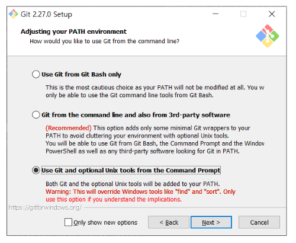
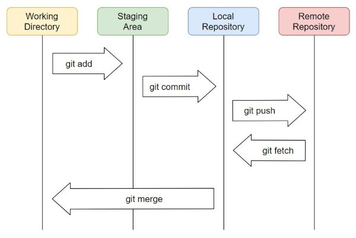

# 깃허브 마스터를 꿈꾸며

먼저 강의를 가르쳐 준 유튜버 동비나 형님 감사합니다.
[동비나 유튜브 링크](https://www.youtube.com/watch?v=rhP5pseOJc0&list=PLRx0vPvlEmdD5FLIdwTM4mKBgyjv4no81)

또 종혁이에게 깃을 가르쳐 주면서 저 스스로 배울 수 있어서 좋은 기회가 되었으면 좋겠습니다.

2020-07-01 ~ 

## 첫번째 목표

원격 저장소에 저장되어있는 파일들을 읽어와 내 컴퓨터의 폴더 디렉토리와 연동시킵니다.  
또는 내 컴퓨터의 폴더에 있는 자료들을 원격 저장소에 올립니다.  

[[reference] Git Commands - Getting and Creating Projects](https://git-scm.com/book/en/v2/Appendix-C%3A-Git-Commands-Getting-and-Creating-Projects)
[[참고자료] Git 명령어 - 프로젝트 가져오기와 생성하기](https://git-scm.com/book/ko/v2/Appendix-C%3A-Git-%EB%AA%85%EB%A0%B9%EC%96%B4-%ED%94%84%EB%A1%9C%EC%A0%9D%ED%8A%B8-%EA%B0%80%EC%A0%B8%EC%98%A4%EA%B8%B0%EC%99%80-%EC%83%9D%EC%84%B1%ED%95%98%EA%B8%B0)

### 1단계: 기본 설정

1. 깃 다운로드 받기
    [권장] 다운로드에 유닉스 명령어를 추가 설정 시 편하게 작업할 수 있습니다.
    
	
2. 깃 설치 되었는지 확인
    명령 프롬포트에서 확인 ``윈도우+R`` -> ``cmd`` -> ``git --version``
	
3. 깃 기본 설정하기
    자신의 이름과 깃허브 아이디를 등록합니다.
    명령 프롬포트에서 등록  ``윈도우+R`` -> ``cmd`` ->
    ```git config global user.name wansang```
    ```git config global user.email wansang93@naver.com```
    
### 2단계: 원격 저장소(깃허브 사이트)와 로컬 저장소(자신의 컴퓨터 깃 폴더) 연동하기

1. 원격 저장소 만들기

2. 원격 저장소와 로컬 저장소 연동하기
    ``` git clone``` 과 ```git init``` 방법이 있습니다.
    이 두가지 방법 모두 결국 .git 폴더(숨김파일 해제시 보임) 를 만드는 작업입니다.
    로컬 저장소에 . git 폴더가 있어야 깃을 시작할 수 있습니다.
    .git 폴더에는 수정내용, 변경사항, 날짜, 올린사람 등등 각종 자료들이 들어있습니다.

    - **```git clone```을 할 경우와 특징**

        1. **원격 저장소에 작성해 둔 파일**들이 있을 때 ```git clone```을 사용합니다.
        2. ```git clone```은 원격 저장소에 있는 것을 다운로드 받아 깃폴더를 만듭니다.
        3. 다운로드와 동시에 자동으로 연동을 해주어  따로 경로 설정을 할 필요는 없습니다.
        4. 즉 다운로드 자체로만으로도 해당 폴더(로컬 저장소)와 원격 저장소가 연동이 되었습니다.
    
    - **```git init``` 을 했을 경우와 특징**
		1. **로컬 저장소에 작성해 둔 파일**들이 있을 때```git init```명령어를 입력합니다.
        2. ```git init```은 로컬 저장소에서 깃을 시작한다는 의미입니다. 해당 로컬 저장소에서 깃을 사용할 수 있게 합니다.
        3. 경로를 설정해 줍니다. 명령어는 ```git remote add origin https://github.com/wansang93/Practice-Git``` 입니다.
        4. 즉 해당 폴더(로컬 저장소)에서 깃 폴더를 생성하여 원격 저장소와 ```git remote``` 명령어를 사용해서 연동을 합니다.

### 3단계: 로컬 저장소에 있는 파일을 수정해서 원격 저장소에 올리기



```git add .```  
```git commit -m "first commit"```:   
```git push```  

## 두번째 목표

로컬 저장소에 있는 파일을 원격 저장소에 올리고 내리기

### 1단계: 파일 올리기, 내리기

1. 추가, 수정, 삭제된 파일이 있는지 확인 및 깃의 현재 상태 표시
	```git status```

2. 파일을 Staging Area 로 올리기
    특정 파일 올리기 -> ```git add <파일 이름>```  
    모든 파일 올리기 -> ```git add .```

3. Staging Area 에 파일을 내리기
	```git reset <파일 이름>```

4. Local Repository에 파일 올리기
	```git commit -m "<작성하고 싶은 메시지>"```

5. Remote Repository에 파일 올리기
	```git push```

### 2단계: 파일 수정 무시하기

5. 추가, 수정, 삭제된 파일이 있는지 확인 및 깃의 현재 상태 표시
	```git status```

6. 파일 수정 무시하기
	```git checkout -- <파일 이름>```

7. 커밋 로그 보기

  ```git log```


## 세번째 목표

커밋 내역을 확인하고 수정하기

커밋 내역을 보면 개발자들이 언제 파일을 수정하고 어떻게 했는지 알 수 있습니다.  
이 기록들을 어떻게 수정할 수 있는지 알아봅시다.

### 1단계: 원격 저장소에 있는 파일 불러와서 커밋 삭제하기

1. 원격 저장소에 있는 파일들 가져오기
    ```git pull```

2. 원하는 커밋으로 돌아가기
    ```git reset --hard <커밋 해쉿값>``` -> 특정 커밋으로부터 최신까지 다 지우겠습니다.  
    ```--hard``` 옵션은 전부 다 지우고  
    ```--sort ```옵션은 윗부분 커밋은 남겨두고 해당 커밋때로 돌아갑니다.
    
3. 커밋 수정 원격 저장소에 올리기
	```git push -f``` -f 로 강제로 푸쉬해야 가능합니다.
	
### 2단계: 커밋 메시지 수정하기

가장 최근에 커밋한 메시지를 수정하는 방법입니다.

1. ```git commit --amend``` 입력 
2. Unix 에디터에 들어오면 관리자 모드와 수정모드로 나뉩니다. 
3. 수정모드로 가기위해 ```a```나 ```i```키를 눌릅니다.
4. 원하는 글자로 커서를 옮긴 뒤 수정합니다. 
5. 수정이 완료되면 ```ESC```를 누르고 ```:wq!```(저장 후 종료) 를 씁니다.
6. 로컬 저장소로 강제로 푸쉬 ```git push -f```합니다.

## 네번째 목표

깃의 꽃인 Branch를 사용해보자  
[강의 링크](https://www.youtube.com/watch?v=I4latDqXo5M&list=PLRx0vPvlEmdD5FLIdwTM4mKBgyjv4no81&index=7)

1. 깃 브렌치를 현재 브렌치를 확인합니다. ```git branch```
2. 깃 브렌치를 만듭니다. ```git branch <원하는 브렌치 이름>```
3. 깃 체크아웃으로 브렌치를 이동합니다. ```git checkout <원하는 브렌치>```
4. 깃 브렌치로 다시 현재 브렌치를 확인합니다. ```git branch```
5. 
